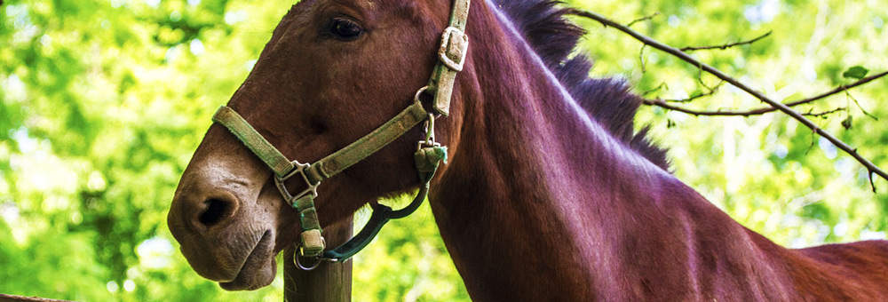

<!DOCTYPE html>
<html lang="en">
<head>
    <meta charset="UTF-8">
    <meta name="viewport" content="width=device-width, initial-scale=1.0">
    <title>Yan_Torzhevsk</title>
    <link rel="stylesheet" type="text/css" href="styles.css">
</head>
<body>
    <h1>Barn animal</h1>
    
 
        <a href="button_page.html">Home</a>
        <a href="button_page.html">Blog</a>
        <a href="button_page.html">Photos</a>
        <a href="button_page.html">About</a>
        <a href="button_page.html">Links</a>
        <a href="button_page.html">Contact</a>
    

    
    

    <h2>praesent scelerisque scelerisque</h2>
    
This is Barn Animal, a free standarts-compliant CSS template by <b>TEMPLATED</b>. The picture in this template is from <b>Fotograph</b>. This free template is released under the <b>Creative Commons Attribution</b> license, so you're pretty much free to do whatever you want with it(even use it comercially) provided you give us credit for it. Have fun :)

    

    

        <li><h2>etiam posuere augue</h2>
        Aliquam libero 
        Consectetuer adippiscing elit 
        Metus aliquam pellentesque 
        Suspendisse iaculis mauris 
        Consectetuer adippiscing elit 
        nulla iuctus eleifend</li>

        <li><h2> nulla luctus eleifend</h2>
        Aliquam libero 
        Consectetuer adippiscing elit 
        Metus aliquam pellentesque 
        Suspendisse iaculis mauris 
        Consectetuer adippiscing elit 
        nulla iuctus eleifend</li>
        

    

        <h2>amet mattis fingilla nisl</h2>
        
          <bl>La cabra (Capra aegagrus hircus) es un mamífero artiodáctilo de la subfamilia
              Caprinae que fue domesticado alrededor del octavo milenio a. C., 
             sobre todo por su carne y leche.1​ Al macho de la cabra se le llama 
             cabrón (si bien en algunos países esta palabra se considera 
             malsonante), así como también cabro, chivato, macho cabrío, 
             irasco o chivo, y a las crías se las llama cabrito, chivo o 
             chivito. Al conjunto de estos animales, criados por el hombre, 
             se le conoce como ganado caprino o ganado cabrío.</bl>
    

    
</body>
</html>
